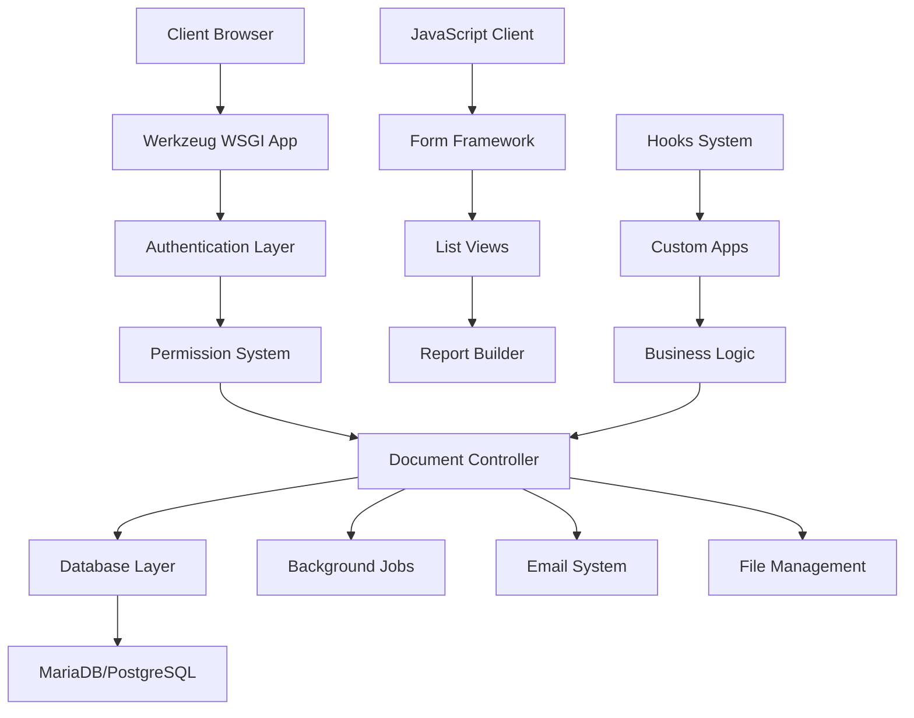

# Frappe Framework - Comprehensive Documentation

> **Last Updated:** August 14, 2025  
> **Framework Version:** 15.x  
> **Documentation Generated from Codebase Analysis**

## 🎯 Overview

This comprehensive documentation provides an in-depth reference for the Frappe Framework - a full-stack, batteries-included web framework written in Python and JavaScript with MariaDB/PostgreSQL as the database. It powers ERPNext and thousands of other applications.

The documentation is based on direct analysis of the framework's source code, ensuring accuracy and completeness for custom application development, troubleshooting, and advanced usage scenarios.

## 📚 Documentation Structure

### Core Framework Documentation

| Document | Description | Topics Covered |
|----------|-------------|---------------|
| **[01 - Framework Overview](01-frappe-overview.md)** | Architecture, philosophy, and setup | Installation, core concepts, development environment |
| **[02 - DocType System](02-doctype-system.md)** | Document management and metadata | DocTypes, fields, relationships, lifecycle |
| **[03 - Server-Side Development](03-server-side-development.md)** | Python backend development | Controllers, ORM, background jobs, email |
| **[04 - Client-Side Development](04-client-side-development.md)** | JavaScript frontend development | Form scripts, custom UI, reports, dashboards |
| **[05 - API & Integrations](05-api-and-integrations.md)** | REST APIs and third-party connections | Authentication, webhooks, data exchange |
| **[06 - Permissions & Security](06-permissions-and-security.md)** | User management and access control | Roles, document-level permissions, security |
| **[07 - Testing Framework](07-testing-framework.md)** | Testing methodologies and tools | Unit tests, integration tests, debugging |
| **[08 - Database Operations](08-database-operations.md)** | Data layer and persistence | Schema management, queries, migrations |
| **[09 - Customization Patterns](09-customization-patterns.md)** | App development best practices | Custom apps, hooks, print formats, workflows |
| **[10 - Deployment & Production](10-deployment-production.md)** | Production setup and scaling | Server configuration, monitoring, performance |
| **[11 - Troubleshooting Guide](11-troubleshooting-guide.md)** | Common issues and solutions | Error resolution, debugging techniques |
| **[12 - Advanced Topics](12-advanced-topics.md)** | Framework internals and extensions | Advanced patterns, system administration |

### Quick Reference Guides

| Reference | Description |
|-----------|-------------|
| **[Glossary](glossary.md)** | Framework terminology and definitions |
| **[Quick Reference](quick-reference.md)** | Common commands, patterns, and code snippets |
| **[Use Case Index](use-case-index.md)** | Scenario-based navigation guide |

## 🚀 Quick Start

### New to Frappe?
Start with [Framework Overview](01-frappe-overview.md) to understand core concepts and architecture.

### Building Custom Apps?
Jump to [Customization Patterns](09-customization-patterns.md) and [Server-Side Development](03-server-side-development.md).

### Need Specific Solutions?
Use the [Use Case Index](use-case-index.md) for scenario-based navigation.

### Troubleshooting Issues?
Check the [Troubleshooting Guide](11-troubleshooting-guide.md) for common problems and solutions.

## 🎯 Content Focus Areas

### For Developers
- **Custom Application Development**: Complete patterns and best practices
- **API Integration**: REST endpoints, webhooks, and third-party connections  
- **Testing Strategies**: Comprehensive testing approaches for Frappe apps
- **Performance Optimization**: Database queries, caching, and scaling techniques

### For System Administrators  
- **Production Deployment**: Server setup, configuration, and maintenance
- **Security Implementation**: Authentication, authorization, and data protection
- **Monitoring & Logging**: System health and performance tracking
- **Backup & Recovery**: Data protection and disaster recovery procedures

### For Business Users
- **Customization Options**: Field customizations, print formats, and workflows
- **Report Generation**: Custom reports and data analysis
- **User Management**: Role-based access control and permissions
- **Integration Scenarios**: Connecting with external systems

## 🔧 Framework Architecture Overview

## 📋 Key Framework Components

### Core Systems
- **Document Model**: Object-relational mapping with metadata-driven schema
- **Permission Engine**: Role-based access control with document-level granularity  
- **Queue System**: Redis-based background job processing
- **Template Engine**: Jinja2-based templating with custom extensions
- **API Framework**: RESTful endpoints with automatic documentation
- **Real-time Updates**: WebSocket-based live updates

### Development Tools
- **Bench CLI**: Development and deployment management tool
- **Migration System**: Database schema versioning and updates
- **Translation Framework**: Multi-language support with extraction tools
- **Error Tracking**: Comprehensive logging and error reporting
- **Performance Monitoring**: Built-in profiling and metrics collection

## 🎓 Learning Path

### Beginner (New to Frappe)
1. [Framework Overview](01-frappe-overview.md) - Core concepts
2. [DocType System](02-doctype-system.md) - Data modeling
3. [Quick Reference](quick-reference.md) - Common patterns

### Intermediate (Building Apps)
1. [Server-Side Development](03-server-side-development.md) - Backend logic
2. [Client-Side Development](04-client-side-development.md) - Frontend customization
3. [Customization Patterns](09-customization-patterns.md) - Best practices

### Advanced (Production & Scaling)
1. [Database Operations](08-database-operations.md) - Performance optimization
2. [Deployment & Production](10-deployment-production.md) - Scaling strategies  
3. [Advanced Topics](12-advanced-topics.md) - Framework internals

## 🔍 Search and Navigation

### By Development Stage
- **Planning**: [Framework Overview](01-frappe-overview.md), [Use Case Index](use-case-index.md)
- **Development**: [Server-Side](03-server-side-development.md), [Client-Side](04-client-side-development.md), [API Integration](05-api-and-integrations.md)
- **Testing**: [Testing Framework](07-testing-framework.md), [Troubleshooting](11-troubleshooting-guide.md)
- **Deployment**: [Production Guide](10-deployment-production.md), [Database Operations](08-database-operations.md)

### By Component
- **Data Models**: [DocType System](02-doctype-system.md), [Database Operations](08-database-operations.md)
- **User Interface**: [Client-Side Development](04-client-side-development.md), [Customization Patterns](09-customization-patterns.md)  
- **Security**: [Permissions & Security](06-permissions-and-security.md), [API Integration](05-api-and-integrations.md)
- **Integration**: [API & Integrations](05-api-and-integrations.md), [Advanced Topics](12-advanced-topics.md)

## 📖 Documentation Standards

### Content Quality
- **Source Accuracy**: All examples based on actual framework source code
- **Version Alignment**: Documentation matches current framework version (v15.x)
- **Practical Focus**: Real-world scenarios and working code examples
- **Cross-References**: Comprehensive linking between related concepts

### Code Examples
- **Complete Examples**: Full, runnable code snippets
- **File References**: Actual file paths and line numbers from source
- **Error Handling**: Proper exception handling patterns
- **Performance Considerations**: Optimization notes and best practices

### Navigation Aids
- **Table of Contents**: Each document includes detailed navigation
- **Cross-References**: Links to related sections across documents
- **Quick Lookups**: Search-friendly headers and keyword tagging
- **Visual Aids**: Diagrams and flowcharts where helpful

## 🤝 Contributing

This documentation is generated through direct codebase analysis. For suggestions or corrections:

1. Review the corresponding source code files in `/home/frappe/frappe-bench/apps/frappe/`
2. Verify examples against the actual framework implementation
3. Check version compatibility with your Frappe installation
4. Submit issues with specific file references and line numbers

## 📄 License

This documentation follows the same MIT license as the Frappe Framework.

---

**Ready to dive in?** Start with the [Framework Overview](01-frappe-overview.md) or jump to any specific topic using the navigation above.