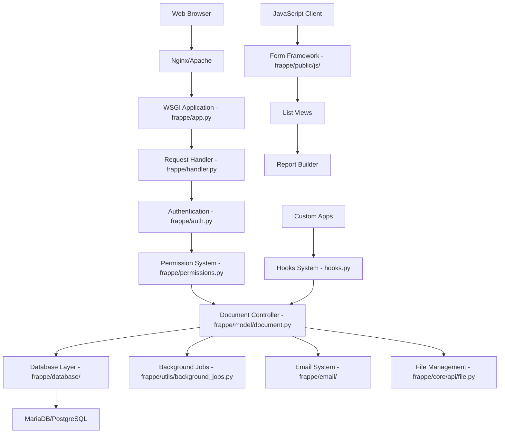

# Frappe Framework Overview

> **Complete guide to understanding Frappe's architecture, philosophy, and setup procedures**

## Table of Contents

- [What is Frappe Framework?](#what-is-frappe-framework)
- [Core Philosophy & Design Principles](#core-philosophy--design-principles)
- [Architecture Overview](#architecture-overview)
- [Key Components & Systems](#key-components--systems)
- [Installation & Setup](#installation--setup)
- [Development Environment](#development-environment)
- [Framework vs ERPNext](#framework-vs-erpnext)
- [Getting Started Guide](#getting-started-guide)
- [Next Steps](#next-steps)

## What is Frappe Framework?

Frappe (pronounced "fra-pay") is a **full-stack, batteries-included web framework** written in Python and JavaScript with MariaDB/PostgreSQL as the database backend. It's designed to help developers build database-driven business applications quickly and efficiently.

### Key Characteristics

**Full-Stack Framework**
```python
# Based on analysis of frappe/__init__.py:54
__version__ = "15.63.1"
__title__ = "Frappe Framework"
```

- **Backend**: Python 3.10+ with extensive ORM and business logic capabilities
- **Frontend**: JavaScript with a tightly integrated client-side framework
- **Database**: MariaDB (primary) or PostgreSQL support
- **Web Server**: WSGI-compliant (Werkzeug-based) application server

**Batteries-Included Philosophy**
- User management and authentication
- Role-based permissions system
- Email integration and templating
- Background job processing
- Real-time updates via WebSockets
- Multi-language support
- File management and attachments
- Audit trails and versioning
- Print format engine
- Report builder
- REST API framework

### Primary Use Cases

1. **Business Applications**: ERP systems, CRM, project management tools
2. **Database-Driven Apps**: Any application requiring complex data relationships
3. **Multi-User Systems**: Applications with sophisticated permission requirements
4. **Integration Platforms**: Systems that need to connect with multiple third-party services

## Core Philosophy & Design Principles

### 1. Metadata-Driven Development

Frappe uses a **metadata-first approach** where the application structure is defined through DocTypes rather than traditional database schemas.

```python
# From frappe/model/meta.py:65
def get_meta(doctype, cached=True) -> "Meta":
    cached = cached and isinstance(doctype, str)
    if cached and (meta := frappe.cache.hget("doctype_meta", doctype)):
        return meta
    
    meta = Meta(doctype)
    frappe.cache.hset("doctype_meta", meta.name, meta)
    return meta
```

**Benefits:**
- Dynamic schema evolution without downtime
- Automatic form generation from metadata
- Built-in validation and field type handling
- Consistent data handling across the application

### 2. Convention Over Configuration

Frappe follows predictable patterns that reduce configuration overhead:

```
my_app/
├── modules.txt              # List of modules
├── hooks.py                 # Application hooks and configuration
└── my_module/
    └── doctype/
        └── my_doctype/
            ├── my_doctype.json     # DocType definition
            ├── my_doctype.py       # Server-side controller
            └── my_doctype.js       # Client-side controller
```

### 3. Rapid Application Development

The framework prioritizes developer productivity through:
- **Auto-generated APIs**: REST endpoints created automatically for all DocTypes
- **Built-in UI Components**: Forms, lists, reports generated from metadata
- **Declarative Validations**: Define business rules in JSON metadata
- **Extensible Hooks System**: Customize behavior without modifying core code

## Architecture Overview

### High-Level Architecture



### Request Lifecycle

Based on analysis of `frappe/app.py:94`:

1. **Request Initialization** (`init_request`)
   ```python
   def init_request(request):
       frappe.local.request = request
       site = _site or request.headers.get("X-Frappe-Site-Name") or get_site_name(request.host)
       frappe.init(site=site, sites_path=_sites_path, force=True)
   ```

2. **Authentication** (`validate_auth`)
   - Session validation
   - User context establishment
   - Permission loading

3. **Request Routing**
   ```python
   # From frappe/app.py:114-127
   elif request.path.startswith("/api/"):
       response = frappe.api.handle(request)
   elif request.path.startswith("/backups"):
       response = frappe.utils.response.download_backup(request.path)
   elif request.method in ("GET", "HEAD", "POST"):
       response = get_response()  # Website/form handling
   ```

4. **Response Processing**
   - Database transaction management
   - Session updates
   - Response headers (CORS, caching, etc.)

### Thread-Local Storage Pattern

Frappe uses Werkzeug's Local for thread-safe global state:

```python
# From frappe/__init__.py:87
local = Local()

# Global variables that are actually thread-local
db = local("db")
qb = local("qb")  # Query builder
conf = local("conf")
form_dict = local("form_dict")
request = local("request")
session = local("session")
user = local("user")
```

## Key Components & Systems

### 1. Document System

**Core Document Class** (`frappe/model/document.py`):

```python
class Document(BaseDocument):
    """All controllers inherit from `Document`."""
    
    doctype: DF.Data
    name: DF.Data | None
    flags: frappe._dict[str, Any]
    owner: DF.Link
    creation: DF.Datetime
    modified: DF.Datetime
    modified_by: DF.Link
    idx: DF.Int
```

**Document Lifecycle**:
- `before_validate` → `validate` → `after_validate`
- `before_insert` → `after_insert`  
- `before_save` → `after_save`
- `before_submit` → `after_submit`
- `before_cancel` → `after_cancel`

### 2. Database Abstraction

**Database Class** (`frappe/database/database.py:54`):

```python
class Database:
    """
    Open a database connection with the given parameters, if use_default is True, use the
    login details from `conf.py`. This is called by the request handler and is accessible using
    the `db` global variable. the `sql` method is also global to run queries
    """
    
    VARCHAR_LEN = 140
    MAX_COLUMN_LENGTH = 64
    DEFAULT_COLUMNS = ("name", "creation", "modified", "modified_by", "owner", "docstatus", "idx")
```

**Query Builder Integration**:
- PyPika-based query construction
- Support for both MariaDB and PostgreSQL
- Automatic query optimization and caching

### 3. Permission System

**Multi-Level Permission Architecture**:
1. **Role Permissions**: What roles can do with DocTypes
2. **User Permissions**: Which specific documents users can access
3. **Share Permissions**: Document-specific sharing rules
4. **Field-Level Permissions**: Granular field access control

### 4. Background Job System

**Redis-Based Queue System** (`frappe/utils/background_jobs.py`):

```python
@frappe.task(queue='long')
def process_large_report(report_name, filters):
    """Example background task"""
    # Long-running operation
    return results
```

### 5. Real-Time System

**WebSocket Integration** (`frappe/realtime.py`):
- Document updates
- Progress notifications
- Chat and collaboration features

## Installation & Setup

### Prerequisites

**System Requirements**:
- Python 3.10 or higher
- Node.js 18 or higher  
- MariaDB 10.6+ or PostgreSQL 13+
- Redis 6.0+
- wkhtmltopdf (for PDF generation)

### Production Installation

**1. Managed Hosting (Recommended)**
```bash
# Frappe Cloud - Official managed hosting
# Visit: https://frappecloud.com/
```

**2. Docker Installation**
```bash
# Easy install script
curl -fsSL https://get.frappe.io | bash

# Or manual Docker setup
git clone https://github.com/frappe/frappe_docker.git
cd frappe_docker
docker-compose up -d
```

**3. Manual Installation**
```bash
# Install bench CLI tool
pip install frappe-bench

# Create new bench
bench init frappe-bench
cd frappe-bench

# Create new site
bench new-site mysite.local
```

### Development Installation

**Using Docker (Recommended for Development)**:
```bash
# Clone and setup development environment
git clone https://github.com/frappe/frappe_docker.git
cd frappe_docker

# Development with live reload
docker-compose -f docker-compose.yml -f overrides/compose.noproxy.yml up -d
```

**Bare Metal Development Setup**:
```bash
# Install system dependencies (Ubuntu/Debian)
sudo apt-get install python3-dev python3-pip python3-venv mariadb-server redis-server

# Install bench
pip3 install frappe-bench

# Initialize bench
bench init frappe-bench --frappe-branch develop
cd frappe-bench

# Create development site  
bench new-site development.localhost
bench use development.localhost

# Start development server
bench start
```

## Development Environment

### Directory Structure

After installation, your development environment looks like:

```
frappe-bench/                    # Bench directory
├── apps/                        # All applications
│   ├── frappe/                  # Core framework
│   └── custom_app/              # Your custom applications
├── sites/                       # Site instances
│   ├── development.localhost/   # Development site
│   │   ├── site_config.json     # Site configuration
│   │   └── private/            # Private files
│   └── common_site_config.json  # Global configuration
├── config/                      # Server configurations
├── logs/                        # Application logs
└── env/                         # Python virtual environment
```

### Development Workflow

**1. Create Custom App**:
```bash
bench new-app my_app
bench install-app my_app
```

**2. Create DocType**:
```bash
# Through UI: Go to Desk → DocType → New
# Or programmatically create JSON definition
```

**3. Enable Developer Mode**:
```python
# In site_config.json
{
    "developer_mode": 1,
    "disable_website_cache": 1
}
```

**4. Database Migrations**:
```bash
bench migrate
bench clear-cache
bench restart
```

### Key Development Commands

```bash
# Start development server
bench start

# Install/update apps
bench install-app app_name
bench update

# Database operations
bench migrate
bench backup
bench restore database_file

# Clear caches
bench clear-cache
bench clear-website-cache

# Development utilities
bench console              # Python console
bench set-config key value # Set configuration
bench doctor               # Diagnose issues
```

## Framework vs ERPNext

### Relationship

**Frappe Framework** is the underlying infrastructure that powers **ERPNext** (and other applications):

```
ERPNext (Business Application)
    ↓
Frappe Framework (Development Platform)
    ↓
Python/JavaScript/MariaDB (Technology Stack)
```

### Key Differences

| Aspect | Frappe Framework | ERPNext |
|--------|------------------|---------|
| **Purpose** | Development platform | Business application |
| **Components** | Core framework features | Business modules (Accounting, HR, etc.) |
| **Target Users** | Developers | End users / businesses |
| **Customization** | Build custom apps | Configure business processes |
| **Installation** | Minimal core features | Full business application |

### When to Use Which

**Use Frappe Framework When**:
- Building custom business applications
- Need specific industry solutions
- Require extensive customization
- Want to leverage the framework's architecture

**Use ERPNext When**:
- Need a complete ERP solution
- Standard business processes fit your needs
- Want quick deployment with minimal development

## Getting Started Guide

### 1. Your First Custom App

```bash
# Create new app
bench new-app library_management
cd apps/library_management

# Install the app
bench install-app library_management
```

### 2. Create Your First DocType

**Through Web Interface**:
1. Navigate to Desk → DocType → New
2. Create "Library Member" DocType
3. Add fields: member_name, email, phone, address

**DocType JSON Structure**:
```json
{
    "doctype": "DocType",
    "name": "Library Member",
    "module": "Library Management",
    "fields": [
        {
            "fieldname": "member_name",
            "fieldtype": "Data",
            "label": "Member Name",
            "reqd": 1
        },
        {
            "fieldname": "email",
            "fieldtype": "Data",
            "label": "Email",
            "options": "Email"
        }
    ]
}
```

### 3. Add Server-Side Logic

```python
# apps/library_management/library_management/doctype/library_member/library_member.py
import frappe
from frappe.model.document import Document

class LibraryMember(Document):
    def validate(self):
        # Custom validation logic
        if not self.email:
            frappe.throw("Email is mandatory")
    
    def before_save(self):
        # Pre-save processing
        self.full_name = f"{self.first_name} {self.last_name}"
    
    def after_insert(self):
        # Post-creation actions
        frappe.msgprint(f"Welcome {self.member_name}!")
```

### 4. Add Client-Side Logic

```javascript
// apps/library_management/library_management/doctype/library_member/library_member.js
frappe.ui.form.on('Library Member', {
    refresh: function(frm) {
        // Add custom button
        frm.add_custom_button(__('Send Welcome Email'), function() {
            frappe.call({
                method: 'library_management.api.send_welcome_email',
                args: {
                    member: frm.doc.name
                },
                callback: function(r) {
                    frappe.msgprint(__('Welcome email sent!'));
                }
            });
        });
    },
    
    email: function(frm) {
        // Validate email format
        if (frm.doc.email && !frappe.utils.validate_type(frm.doc.email, 'email')) {
            frappe.msgprint(__('Please enter a valid email address'));
        }
    }
});
```

### 5. Create API Endpoints

```python
# apps/library_management/library_management/api.py
import frappe

@frappe.whitelist()
def get_member_stats():
    """Get library member statistics"""
    return {
        'total_members': frappe.db.count('Library Member'),
        'active_members': frappe.db.count('Library Member', {'status': 'Active'}),
    }

@frappe.whitelist()
def send_welcome_email(member):
    """Send welcome email to member"""
    doc = frappe.get_doc('Library Member', member)
    # Email sending logic here
    return {'success': True}
```

### 6. Test Your Application

```bash
# Run the development server
bench start

# Open browser and navigate to your site
# http://development.localhost:8000

# Create test records and verify functionality
```

## Next Steps

### Continue Learning

1. **[DocType System](02-doctype-system.md)**: Deep dive into data modeling
2. **[Server-Side Development](03-server-side-development.md)**: Advanced Python patterns
3. **[Client-Side Development](04-client-side-development.md)**: JavaScript customization
4. **[API & Integrations](05-api-and-integrations.md)**: REST API and third-party integration

### Advanced Topics

- **Custom Print Formats**: Design professional documents
- **Report Builder**: Create complex data reports  
- **Workflow Management**: Define business approval processes
- **Multi-tenancy**: Deploy apps for multiple clients
- **Performance Optimization**: Scale for high-traffic scenarios

### Community & Resources

- **Official Documentation**: [frappeframework.com](https://frappeframework.com/docs)
- **Learning Platform**: [frappe.school](https://frappe.school)
- **Community Forum**: [discuss.erpnext.com](https://discuss.erpnext.com)
- **GitHub Repository**: [github.com/frappe/frappe](https://github.com/frappe/frappe)

### Development Best Practices

1. **Follow Naming Conventions**: Use snake_case for Python, camelCase for JavaScript
2. **Use Version Control**: Track changes with Git
3. **Write Tests**: Create unit and integration tests
4. **Document APIs**: Use docstrings and comments
5. **Handle Errors Gracefully**: Implement proper error handling
6. **Optimize Performance**: Consider database queries and caching

---

**Ready for the next step?** Dive into the [DocType System](02-doctype-system.md) to learn how to model your data effectively.